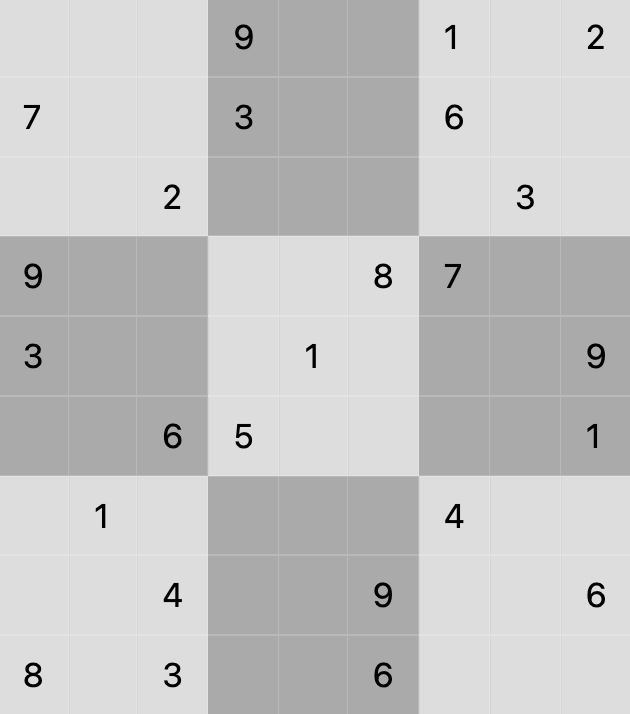

# Solving a Sudoku

The following image shows a challenging Sudoku puzzle.

A sudoku puzzle solution must satisfy the following rules.

1. Each column contains the numbers 1-9 exactly once.  
2. Each row contains the numbers 1-9 exactly once.  
3. If we divide the grid into 9 subsquares by grouping rows/columns (0-2),
 (3-5), and (6-8), each subsquare has the numbers 1-9
 exactly once.

## The Exercise

Use the framework code provided to solve the Sudoku puzzle shown above. The rules
provided describe three different types of constraints. These constraints must
be added to the constrained quadratic model to complete the exercise.

### Variable Definition

The code provided includes an initial definition of variables to be used.
Binary variables have been defined as `x[i][j][k]`, where `i` indicates the row
index, `j` indicates the column index, and `k` indicates a digit from 1-9.
Using this description, we define `x[i][j][k] == 1` if the entry in row `i`,
column `j` equals digit `k`.
